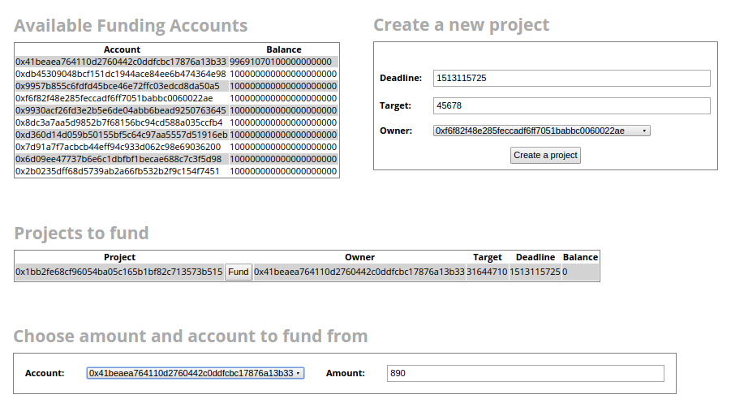
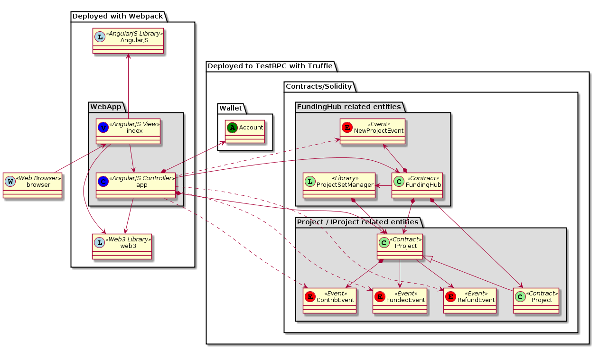

# Damien Conroy - final project 

## Getting started
This is a project created with Truffle v3.1.2 and Webpack using AngularJS with TestRPC as the target client.
Please see [the Truffle 3 guide](http://truffleframework.com/tutorials/building-testing-frontend-app-truffle-3) for more detail.

From the project directory run `truffle compile` followed by `truffle migrate` (ensure that there is a running instance of TestRPC on port 8545 available) to build and deploy the project, then run 
`npm run build` (refer to [the Truffle 3 guide](http://truffleframework.com/tutorials/building-testing-frontend-app-truffle-3)).

Please ensure that other applications that may provide web3 to the browser (such as MetaMask) are disabled so that the TestRPC accounts may be used. Adaptations may be made to use other wallets later. 

## Using the application
Visit `localhost:8080`. The screen should look similar to the following:
        

### Accounts
The application uses the accounts provided by TestRPC. When the application starts, the first account in the list will have paid to have the application set up and its balance will be slightly lower than the others. 

### Projects
When the application starts there is only one project available for funding. It is created by default as part of the Truffle migration task and belongs to the account that funded the migration.

To create new projects the form at the top-right of the screen can be used.

To create a new project:
1. Choose a deadline by which the project must be funded. This is provided as a number of seconds from epoch.
2. Set a target in Wei to be raised by the project.
3. Identify the owner of the project. This account will cover the gas for creating the project and will receive the project's funds if the project is fully funded before the deadline.
4. Click on the 'Create a Project' button and the project will appear in the list of projects available for funding.

### Funding
To fund a project:
1. In the form at the bottom of the screen choose an account to fund from and an amount to fund.
2. In the list of projects to fund find the project that you wish to fund.
3. Beside the project's id is a button labelled 'Fund', press the button to fund the project.

The interface will update to reflect changes to accounts and projects after project creation or funding.

## Contracts, Events, Views and Controllers
The project consists of the following entities:

* __Contracts__
  * __FundingHub (and the ProjectSetManager library)__
  
        The FundingHub contract is used to create and manage projects. It delegates management of the project list to the ProjectSetManager library and emits a NewProjectEvent each time a project is created. It declares the functions required for the final exam.
  * __IProject__

        IProject is an abstract contract that declares the functions and struct required of a project for the final exam. It also defines two types of event - ContribEvent and DeactivateEvent.
  * __Project (and modifiers nonZeroModifier and refundIfPastDeadline)__
  
        Project is an implementation of the IProject contract.
* __Events__
  * __NewProjectEvent (defined in FundingHub)__
  
        A NewProjectEvent is emitted by the funding hub when a new project is created.
  * __ContribEvent (defined in IProject)__
  
        A ContribEvent is emitted by a project when a contribution is made to the project. It prompts the user interface to update and reflect the contribution.

  * __DeactivateEvent (defined in IProject)__
  
        A DeactivateEvent is emitted by a project that is fully funded or refunded. It prompts the user interface to update and remove the project from the project list. It also prompts the user interface to alert the user to the deactivation with a reason: 'funded' or 'refunded'. 
* __Views__
  * __index.html__
  
        The application has one view, ``index.html`` which is an AngularJS view.
* __Controllers__
  * __app.js__
  
        The application has one controller. The controller is based on the Truffle ``app.js`` file which is adapted to be an AngularJS controller. The ``app.js`` file also contains all the client-side logic for rendering the user interface and employs the web3 library to interact with TestRPC. The controller subscribes to all events emitted by the contracts.

## Other final project specifics

* __Testing__

    A test of the refund functionality is provided in a file called ``refunds.js`` in the ``test`` directory. It relies on [``promisifyWeb3.js``](https://gist.github.com/xavierlepretre/90f0feafccc07b267e44a87050b95caa#file-promisifyweb3-js) which is also checked in in the same directory. __For testing purposes the ``refund()`` method of the IProject and Project contracts is ``public``.__ This is because it was difficult to replicate the passing deadline in the tests and __is a vulnerability__ until it is changed. There is a TODO: comment in the code.
    
* __Migration__

    The Truffle migration task calls the ``createProject`` method of the funding hub to create the first project. See the ``2_deploy_contracts.js`` file in the ``migrations`` directory.
    
## Other notes

* __send/withdraw decision__

    In order to keep the user interface / controller relatively simple the contracts ``send`` funds (or ``selfdestruct``) rather than providing a withdrawl function.    

* __Mortal__

    All contracts are mortal.